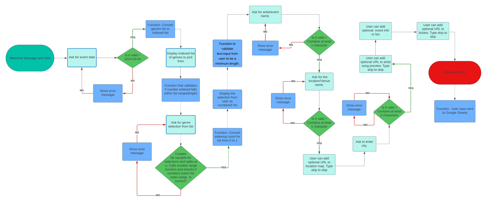
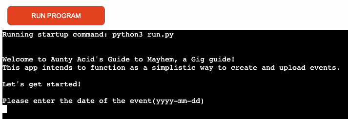
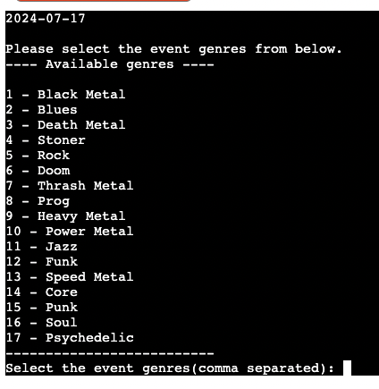
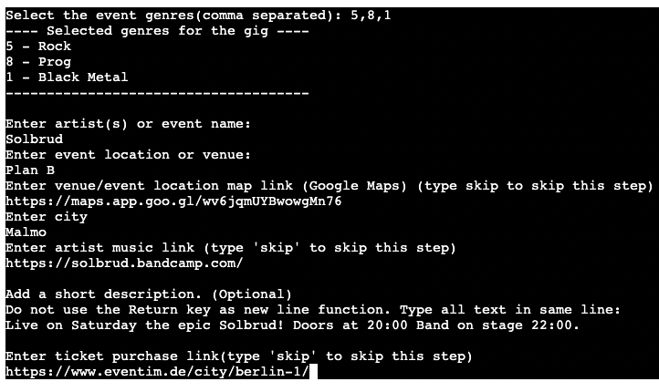
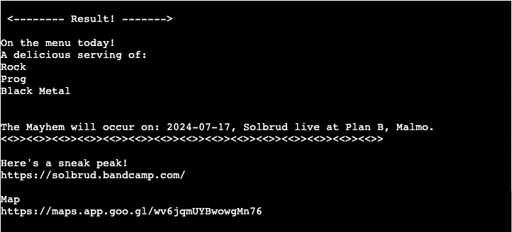
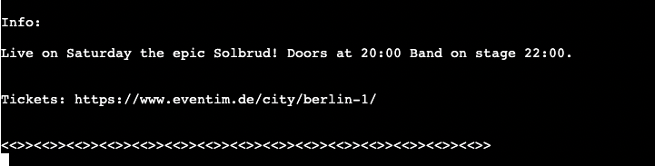

# Aunty Acid's Guide to Mayhem
This is my portfolio 3 project for the Code Institute Full-stack developer course.

Aunty Acid's Guide to Mayhem is a simple application designed for creating and then storing events. Mainly focused on underground and lesser known artists and promoters working with them. Even small venues could benefit from this. The whole idea is to create a platform for people to quickly upload the event information which then gets stored for later use on a front-end application with search functionality. 

It is often extremely hard to find smaller shows in cities. The hope is that the creation of a groundroots, DIY application focussing on fostering a community that can easily follow and explore new music and in such a way grow the music scene. If we are honest, all "big bands" need to come from somewhere. If we do not try and grow the smaller scenes there will be nothing left for future generations to enjoy.

[This is Aunty Acid's Guide to Mayhem!](https://aunty-acids-guide-to-mayhem-279b161d0d9e.herokuapp.com/)

## Project Flow Chart:
I created a diagram, using Lucidchart, hoping to illustrate the flow of the site.
Click on "Details" below:

## Functionality:

### Start:

The app opens with a welcome message and the first input question. 
Asking the user for the event date.

The input then gets validated for the following:
- That the field isn't empty.
- That the length of the characters (including white space) are 10 characters long. Ex. (yyyy-mm-dd).
- That the date uses integers.
- That the date is seperated by dashes "-".
Errors are raised if any of the above do not match.

### Picking the genres:

As soon as the date is entered an indexed list of music genres pops up.
The user is asked to select genres seperated by commas.

The input then gets validated:
- That the input is integers
- That the input number is larger than 0 and within the range of the list index.
Errors are raised if any of the above do not match.

The selected genres are displayed.

### Follow up questions:

Next the user is asked to enter the following:

(Note that not all of the fields are obligatory or has "weak" validation criterea. 
This hopefully encourages the user to input data, which is important in creating an informative event listing and database.)

Artist or event name. Required field.
- Validation for at least 1 character. Error message raised if input doesn't match.

Event Location. Required field.
- Validation for at least 1 character. Error message raised if input doesn't match.

To enter a link with a map to the location.
- This is not a required field and the user has the option to type "skip" to skip the step. 
 Error message raised if no input entered asking to enter valid URL or type "skip"

The city. Required field.
- Validation for at least 3 characters. Error message raised if input doesn't match.

To enter a link to the artists music or other info.
- This is not a required field and the user has the option to type "skip" to skip the step. 
  Error message raised if no input entered asking to enter valid URL or type "skip".

To enter a short desription or bio of the event
- Not validated or required

To enter a link to the ticket sales.
- This is not a required field and the user has the option to type "skip" to skip the step. 
  Error message raised if no input entered asking to enter valid URL or type "skip".

### Execution of user input:

Following the questions the input from the user is compiled in a final message showing the information that was entered.

