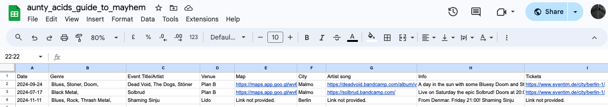

# Aunty Acid's Guide to Mayhem
This is my portfolio 3 project for the Code Institute Full-stack developer course.

Aunty Acid's Guide to Mayhem is a simple application designed for creating and then storing events. Mainly focused on underground and lesser known artists and promoters working with them. Even small venues could benefit from this. The whole idea is to create a platform for people to quickly upload the event information which then gets stored for later use on a front-end application with search functionality. 

It is often extremely hard to find smaller shows in cities. The hope is that the creation of a groundroots, DIY application focussing on fostering a community that can easily follow and explore new music and in such a way grow the music scene. If we are honest, all "big bands" need to come from somewhere. If we do not try and grow the smaller scenes there will be nothing left for future generations to enjoy.

[This is Aunty Acid's Guide to Mayhem!](https://aunty-acids-guide-to-mayhem-279b161d0d9e.herokuapp.com/)

## Project Flow Chart:
I created a diagram, using [Lucidchart](https://lucid.co/), hoping to illustrate the flow of the site.
Click on "Details" below:

[Link to the chart in browser form](https://lucid.app/lucidchart/ea5e7718-ab19-4a36-a4eb-d163ae6fe075/edit?viewport_loc=-590%2C-1696%2C856%2C941%2C0_0&invitationId=inv_ba4934fc-9d8d-411e-b919-e3bce2f83d38)

## Functionality:

### Start:

The app opens with a welcome message and the first input question. 
Asking the user for the event date.

The input then gets validated for the following:
- That the field isn't empty.
- That the length of the characters (including white space) are 10 characters long. Ex. (yyyy-mm-dd).
- That the date uses integers.
- That the date is seperated by dashes "-".

### Date Errors:(Click "Details")

 
 Error raised invalid_date_format:

 Error raised empty_date_field:
 

 Error raised date_seperator_invalid:

### Picking the genres:

As soon as the date is entered an indexed list of music genres pops up.
The user is asked to select genres seperated by commas.

The input then gets validated:
- That the input is integers
- That the input number is larger than 0 and within the range of the list index.
Errors are raised if any of the above do not match.

The selected genres are displayed.

### Errors for genre selection:(Click "Details")

Invalid genre input error:

### Follow up questions:

Next the user is asked to enter the following:

(Note that not all of the fields are obligatory or has "weak" validation criterea. 
This hopefully encourages the user to input data, which is important in creating an informative event listing and database.)

Artist or event name. Required field.
- Validation for at least 1 character. Text-error message raised if input is empty.

Event Location. Required field.
- Validation for at least 1 character. Text-error message raised if input is empty.

To enter a link with a map to the location.
- This is not a required field and the user has the option to type "skip" to skip the step. 
 Error message raised if no input entered asking to enter valid URL or type "skip"

The city. Required field.
- Validation for at least 3 characters. Text-error message raised if input is empty.

To enter a link to the artists music or other info.
- This is not a required field and the user has the option to type "skip" to skip the step. 
  Error message raised if no input entered asking to enter valid URL or type "skip".

To enter a short desription or bio of the event
- Not validated or required

To enter a link to the ticket sales.
- This is not a required field and the user has the option to type "skip" to skip the step. 
  Error message raised if no input entered asking to enter valid URL or type "skip".

### Errors for follow up questions: (Click "Details")

Invalid text input - Empty field error:

Empty URL field error:

 

### Execution of user input:

Following the questions the input from the user is compiled in a final message showing the information that was entered.

### Saving data to Google Sheets:

The final step in the process is for the user input to be saved in a spreadsheet on a Google Sheets API.
A function appends all the input data to the spreadsheet, where the information is sorted by column and each line corresponds to an event. In this way, the input data can be pulled up in a hypothetical app where users can search for events by applying filters such as date, genre, or location.

[Live link to the Google Sheet](https://docs.google.com/spreadsheets/d/1Py7E96MvonBkDE_-dVUzPwbTptsujlIhDiSimhyUU8w/edit?usp=sharing)

## Programming Languages used:

- Python

## Testing, errors and fixes:

- Validated the code in Code Institute CI Python Linter [pep8ci](https://pep8ci.herokuapp.com/#).
  
  I have one error which is an E501 error for a too long line of code. It's on a line of code which I am not able to split up. (Line 296 in the run.py 
  file) The line of code appends input information to a Google Sheet which is a long row of entries. I do not know how to split this line of code. I am worried it 
  might affect the execution. (Click Details)

 

- I had several indentation and whitespace errors which I fixed using CI pep8 linter as guide.

- Had a bare except error which was fixed by specifying the type of error that is expected. In this case a ValueError.

- Struggled to get URL inputs to function. Eventually found help online and imported URL Validator Regex.

- Had some problems with some of the date validation. Specifically "fromisoformat". Found some help online.

- Had a problem trying to allow genres entered without spacing. Used .join to solve this by removing whitespace.
  
- Ran and tested the app on 2 desktop computers.
  The desktop computers worked perfectly fine on both Chrome and Firefox but not Safari.
  
- The user input were tested for all functions making sure that the error messages gets applied when neccessary and correctly.

- Tested the Google Sheet by repeatingly running the program and getting the correct results. 

- Used [Python Tutor](https://pythontutor.com/cp/composingprograms.html#mode=edit) for problem solving help.

- Tested all external and image links provided in the readme file.

- Fixed grammar and typing errors using [Grammarly](https://www.grammarly.com/) 
 

## Acknowledgements:

- My tutor, Antonio Rodriguez, for guidance and patient explanations!

- Learnt about Django Regex URL validation from this thread: [Regex URL Validation](https://stackoverflow.com/questions/7160737/how-to-validate-a-url-in-python-malformed-or-not)

- Learned about __name__ == "__main__" [here:](https://realpython.com/if-name-main-python/)

- Had assistance with date validation from this thread: [.fromisoformat](https://stackoverflow.com/questions/16870663/how-do-i-validate-a-date-string-format-in-python)

- Had assistance with .join for the list selection from this thread [White space removal](https://stackoverflow.com/questions/8270092/remove-all-whitespace-in-a-string)

- Used Google APIs for the Google Sheets spreadsheet. [Google Sheets API](https://console.cloud.google.com/apis/api/sheets.googleapis.com/metrics?project=aunty-acids-guide-to-mayhem)

- Used [Python Tutor](https://pythontutor.com/) for problem solving.

- Used [Lucid chart](https://lucid.co/) for the Flow chart.

- Used [Grammarly](https://www.grammarly.com/) for grammar checking.

- Utilised [CI Python Linter](https://pep8ci.herokuapp.com/#) for pep8 validation.

- Used [Heroku](https://id.heroku.com/login) for deployment.

- Found some assistance to correctly access Google Sheets from [AliOKeeffe's project.](https://github.com/AliOKeeffe/word-Py/blob/main/run.py)

- Had assistence with [bare except clause error](https://www.30secondsofcode.org/python/s/bare-except/).

- Used a devider from [Ascii Art](https://www.asciiart.eu/art-and-design/dividers)

- General learning [W3Schools](https://www.w3schools.com/)

- 

## Deployment:

- Log in to Heroku and click "New" in the top right corner and click "Create new App".

- Select a unique name and pick your region, click "Create App".

- Click the settings tab and click "Reveal Convig Vars"

- Type "port" in the Key field and "8000" in the Value field. Click add.

- Type "CREDS" in the Key field and add your Google Sheet API creds file to the Value field. Click add.

- Next click on "Build Packs" underneath Convig Vars section and, in this order, add:
  Python first
  Nodejs second.

- Scroll back to the top of the page and click "Deploy"

- Select GitHub as deploy method and search for the repository. Click Connect.

- Click "Enable Automatic Deploys"

- Click deploy branch. Wait for a little while.

- Click View.

  

